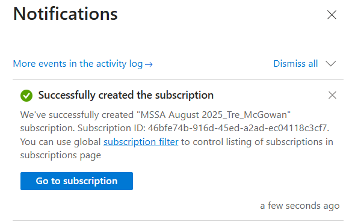
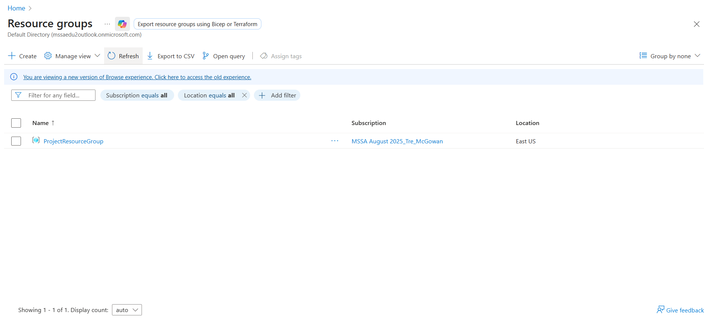
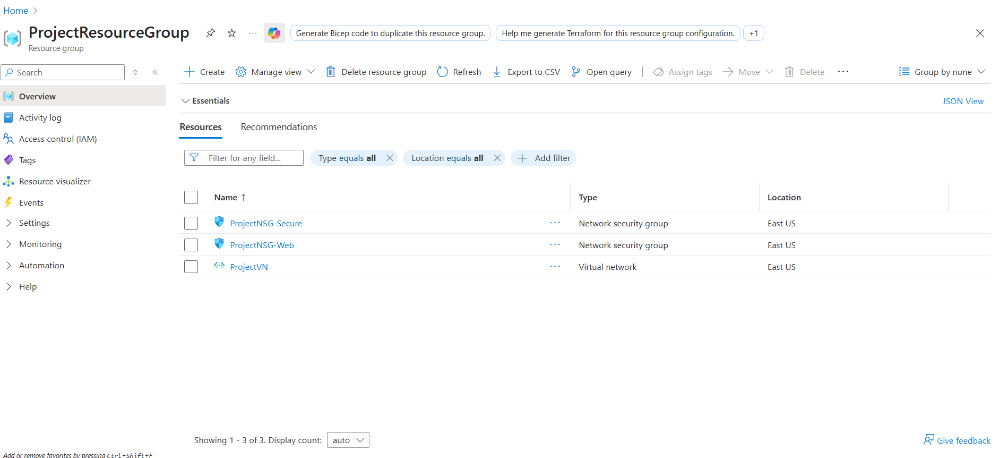
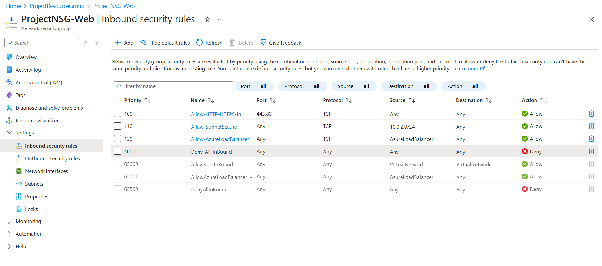
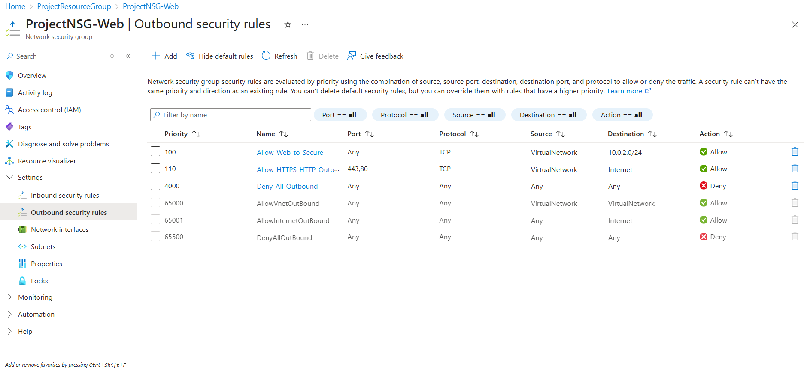

# Secure-Azure-Landing-Zone-for-a-Web-App
This project builds a secure, scalable, and cost-aware Azure environment to host a simple web application.

## Contributing

If you've forked this repository and want to share your improvements or feedback with the original repository owner, please see [CONTRIBUTING.md](CONTRIBUTING.md) for detailed instructions on how to create a pull request.

##  Goals

- Create a secure Azure landing zone using best practices.
- Deploy a web app with managed identity and HTTPS.
- Implement monitoring, logging, and cost controls.
- Document architecture and role-based contributions.

## Phase 1: Set Up and Planning
- In this phase, I am setting up my Azure Account and subscription that I was provided. I was given $200 in credit for Azure to use however I'd like so I will be using it for this project, which I feel highlights many technological skills I have been learning in the Server and Cloud Administration cohort through the Microsoft Software and Systems Academy, as well as just other skills I have been learning on my own.

## Phase 2: Building the Core Infrastructure
- First, we are going to create a resource group and name it "ProjectResourceGroup," and use the East US region to better
ensure a solid balance of proximity and network conditions, with the Central US or East US 2 regions as fallback options depending on the service needs.

- The Second part of the infrastructure I am going to build is the Network Security Groups (NSG) and then the Virtual Network. I am building two NSGs, one called "ProjectNSG-Web"
and another called "ProjectNSG-Secure." These will both have different inbound and outbound rules to create a secure network for our Web App.

- The first NSG is the "ProjectNSG-Web," and I created an inbound rule to allow all HTTPS and HTTP traffic. I also created another inbound rule for my subnet that will be attached to the "ProjectNSG-Secure" to return the traffic from my Subnet called "SubnetWeb," which is attached to "ProjectNSG-Web." After that, I created a new "Deny-All-InBound" rule with a priority of 4000 because it was a custom rule, and I learned that if it's custom, the priority level must be from 100-4096. After that, I received an error message from that Deny All rule I just created because my default Load Balancer rule wouldn't work due to being a lower priority than my deny all rule, so I created a new rule for that as well and placed the priority just above the HTTPS and HTTP rule at 130.

- Next is to configure and create my outbound rules for all traffic for my "ProjectNSG-Web" network security group. The first outbound rule I created was called "Allow-Web-to-Secure," and this allows the backend access communication between my subnets. After that, I then created the next rule "Allow-HTTPS-HTTP-Outbound," allowing the outbound traffic to reach the internet via HTTPS and HTTP only, and the "Deny-All-Outbound," which is the final outbound rule I created, complements the previous rule because it blocks all other outbound traffic unless it's HTTPS or HTTP due to that rule's higher priority. I did this to really try and enforce zero trust.

