# Secure-Azure-Landing-Zone-for-a-Web-App
This project builds a secure, scalable, and cost-aware Azure environment to host a simple web application.
##  Goals

- Create a secure Azure landing zone using best practices.
- Deploy a web app with managed identity and HTTPS.
- Implement monitoring, logging, and cost controls.
- Document architecture and role-based contributions.

## Phase 1: Set Up and Planning
- In this phase, I am setting up my Azure Account and subscription that I was provided. I was given $200 in credit for Azure to use however I'd like so I will be using it for this project, which I feel highlights many technological skills I have been learning in the Server and Cloud Administration cohort through the Microsoft Software and Systems Academy, as well as just other skills I have been learning on my own.
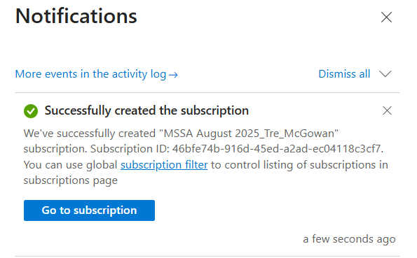

## Phase 2: Building the Core Infrastructure
- First, we are going to create a resource group and name it **"ProjectResourceGroup,"** and use the East US region to better
ensure a solid balance of proximity and network conditions, with the Central US or East US 2 regions as fallback options depending on the service needs.

- The Second part of the infrastructure I am going to build is the Network Security Groups (NSG) and then the Virtual Network. I am building two NSGs, one called **"ProjectNSG-Web"**
and another called **"ProjectNSG-Secure."** These will both have different inbound and outbound rules to create a secure network for our Web App.
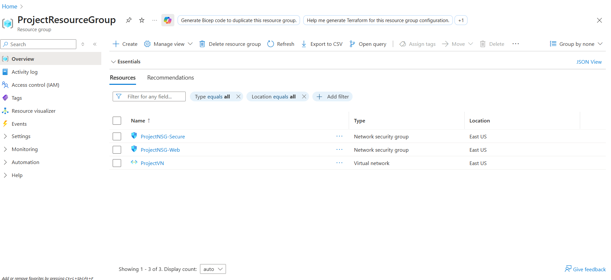

- The first NSG is the **"ProjectNSG-Web,"** and I created an inbound rule to allow all HTTPS and HTTP traffic. I also created another inbound rule for my subnet that will be attached to the **"ProjectNSG-Secure"** to return the traffic from my Subnet called **"SubnetWeb,"** which is attached to **"ProjectNSG-Web."** After that, I created a new **"Deny-All-InBound"** rule with a priority of 4000 because it was a custom rule, and I learned that if it's custom, the priority level must be from 100-4096. After that, I received an error message from that Deny All rule I just created because my default Load Balancer rule wouldn't work due to being a lower priority than my deny all rule, so I created a new rule for that as well and placed the priority just above the HTTPS and HTTP rule at 130.
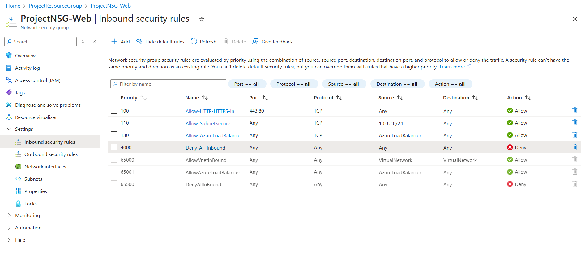

- Next is to configure and create my outbound rules for all traffic for my **"ProjectNSG-Web"** network security group. The first outbound rule I created was called **"Allow-Web-to-Secure,"** and this allows the backend access communication between my subnets. After that, I then created the next rule **"Allow-HTTPS-HTTP-Outbound,"** allowing the outbound traffic to reach the internet via HTTPS and HTTP only, and the **"Deny-All-Outbound,"** which is the final outbound rule I created, complements the previous rule because it blocks all other outbound traffic unless it's HTTPS or HTTP due to that rule's higher priority. I did this to really try and enforce zero trust.
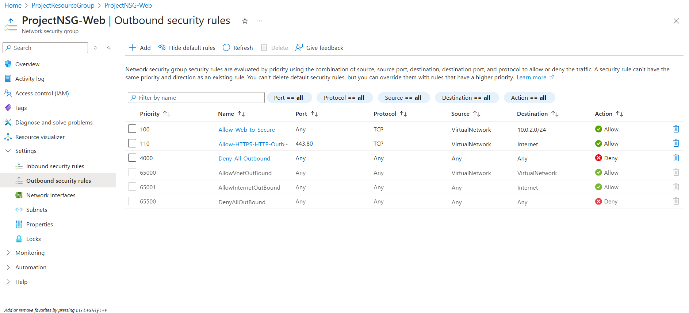

- Next Step in building the Infrastructure is to build the Storage account for my project. This will simulate my web app's data storage, and we will use blob storage since it is the most flexible and best suited for web app content. For this, the Storage account's name is going to be **"ProjectSA9876,"** and I will continue using the same subscription I have been provided. The Configuration of the storage account is using Blob Storage as mentioned earlier. I am also using just Standard performance for cost management and LRS (Locally redundant Storage). Realistically, I would use Zone Redundant Storage to have a minimal disaster recovery plan in place however, this is a quick project to exercise my skills and practice in Azure.
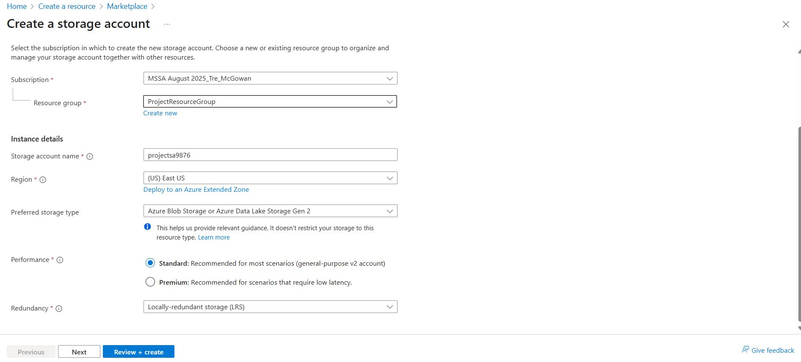
- I am also going to set up a private endpoint connected to my **"SubnetSecure"** to make sure the storage account is only accessible from inside my network, and nobody can access it from the internet. I am denying Public Network Access, which allows outbound access and restricts Inbound access. Then, I created a Private Endpoint called **"PESecureStorage."** After I created that and configured its settings I moved on to Data Protection and made sure that Blob Soft Delete (14 Days), Containers Soft Delete (7 days), Point and Time Restoration for Containers (7 Days), Versioning for Blobs, and finally Blob Change Feed (Keep All Logs) were all enabled with Encryption and Infrastructure Encryption enabled to ensure Defense in Depth, and zero trust (Assuming a breach) was applied.
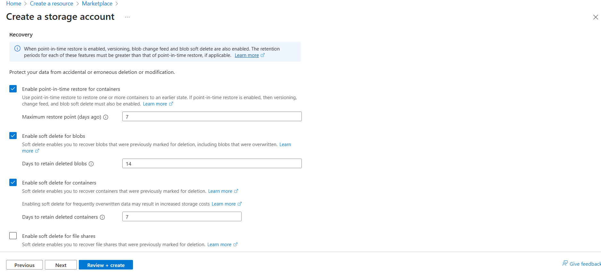
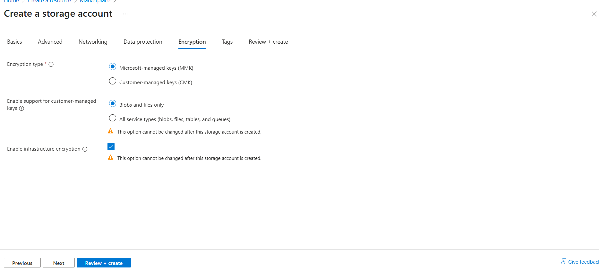

- The Final Step for Phase 2 is to create the key vault for my web app to access secrets like passwords. I really want to once again display and enforce zero trust with this, and always requiring secure internal access is how I will be doing it on this step by utilizing a key vault. I configured the key fault with soft delete enabled and a 90 day retention period. For Access configuration, I am going to use RBAC to practice better governance of the vault and what is inside of it. I denied public access on the networking tab and created a new private endpoint called **"PESecureVault"** for connection to my Virtual network and attached it to my Secure Subnet
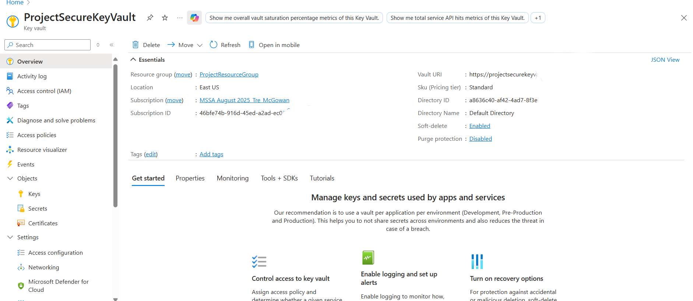

## Phase 3: Deploying and Securing the Web Application
- Now that the secure foundation or "Landing Zone" part of the project is complete, we can move on to creating the Web app to be hosted using Azure App Services. The goal of this phase is to create and deploy the Web App and integrate it with the services created earlier (Storage, Key Vault, VNet, etc).
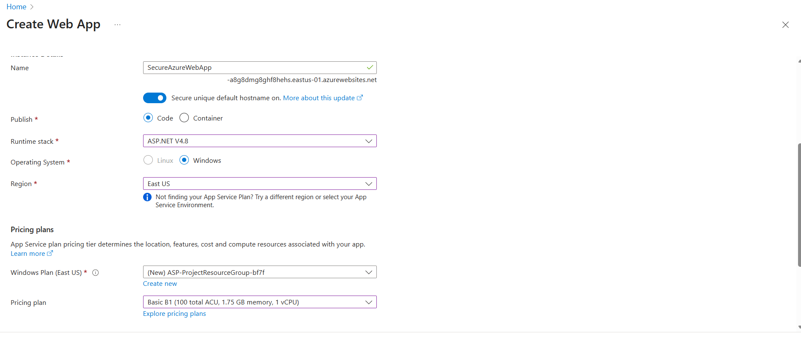
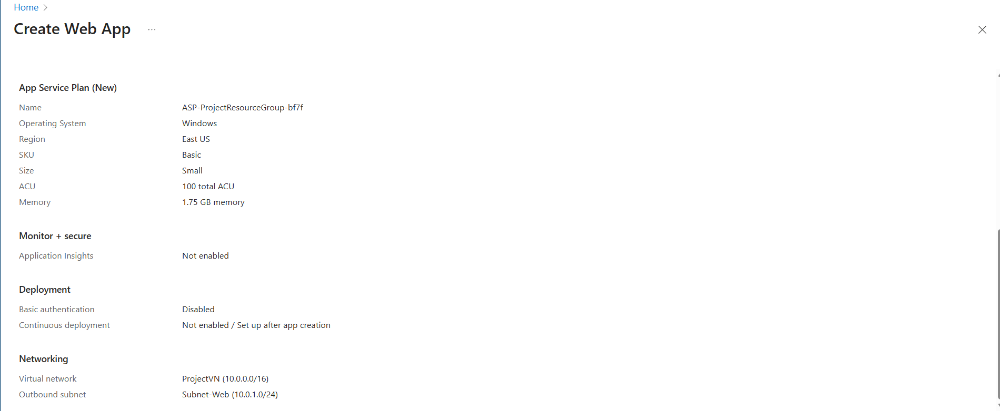

- First Step is creating the Web App, so since this is an Azure project, this will be done using Azure App Service. First, I am going to configure the app named **secureazurewebapp-a8g8dmg8ghf8hehs.eastus-01.azurewebsites.net** by placing it in the **"ProjectResourceGroup"** and in the East US region, like everything else that has been created so far. For the runtime stack, I used ASP.NET V4.8 because, after looking at some options, this seems to be the simplest for a beginner project, and since I am not a coding wizard, I am using this because there is a wide variety of tutorials and FAQ's for ASP.NET to help with any future problems. I am using the Basic tier pricing plan that offers 100 total ACU, 1.75 GB memory, 1 vCPU because my goal is to build this using as few credits available to me but also to enable Virtual Network integration. For the VNet integration, I am going to allow public access for people (recruiters or portfolio reviewers) to view the app, I am also using the **"Subnet-Web"** because this is public facing. After that, it's as simple as hitting "review+create."

- I am also turning on **"System Assigned"** in the Identity blade of the Web App to allow my web app to securely authenticate to the Key Vault and Storage without storing any credentials. After That I am going to connect the Key Vault and Storage by granting the Web App access to secrets in the Key Vault, I actually learned you can do this multiple ways but he way I did it was going to the Identiy blade on **"SecureAzureWebApp"** and added the role assignment **"Key Vaults Secrets User"** from there, then i went to the Access Control (IAM) blade on the key vault to confirm it was applied.
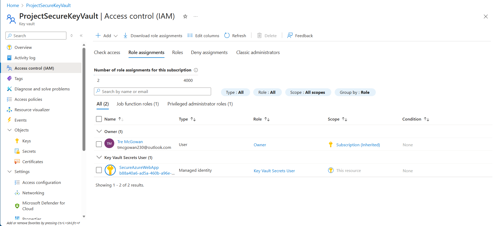
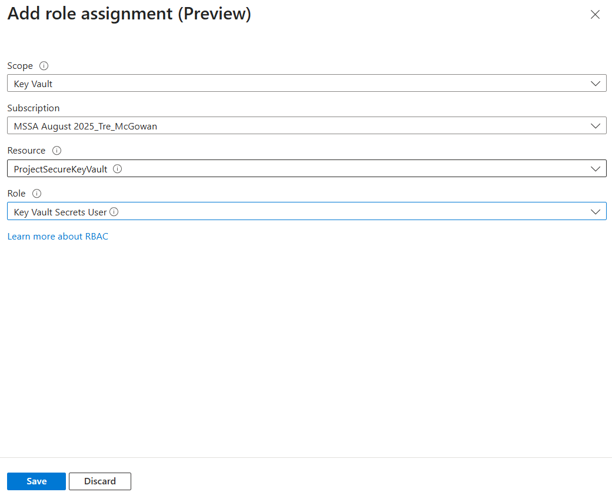

- Last Step for Phase 3 is to test the connectivity to the Key Vault to make sure that the Web App can reach the Key Vault privately and that anyone not authenticated to do so cannot reach it. I used the **console** in the Azure Web App resource under the **"Development Tools"** and ran some commands in Bash to check the connectivity,this is a small step but crucial to ensure that  I have achieved a Zero Trust Design and that it is working well.
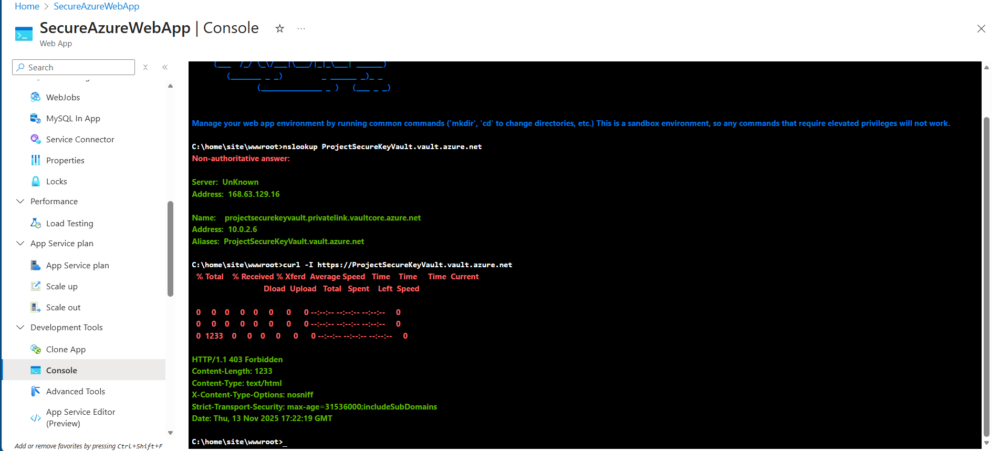

